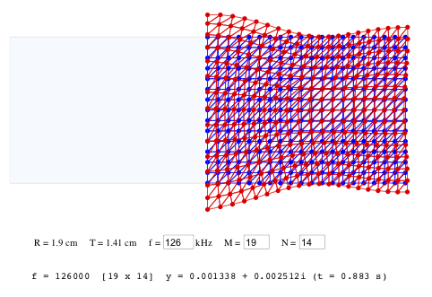
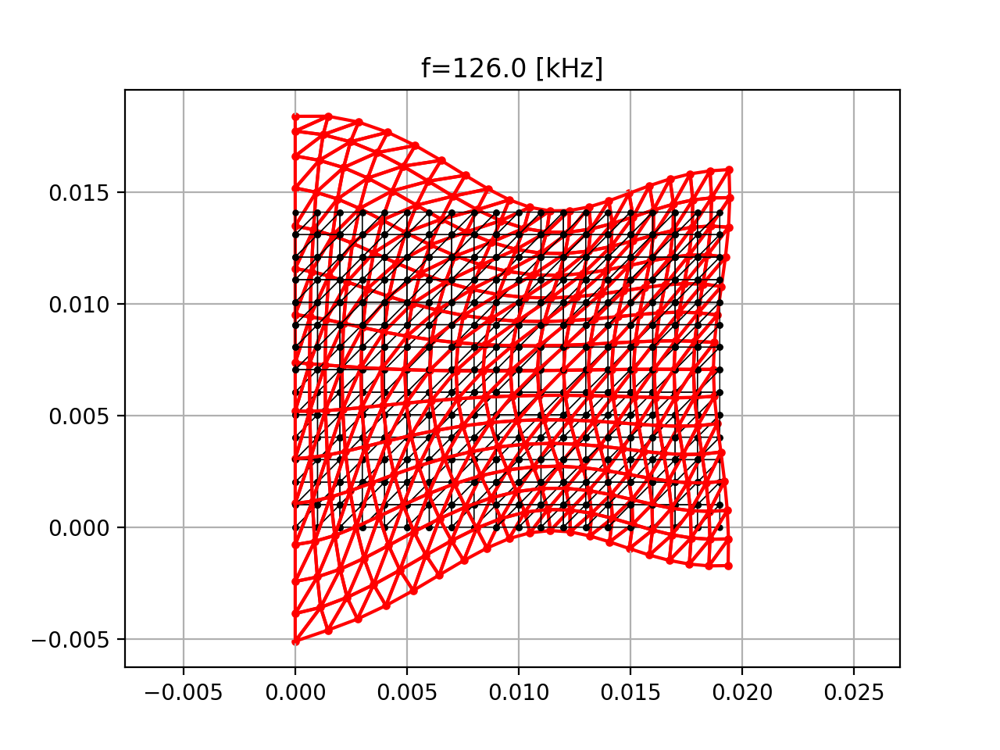
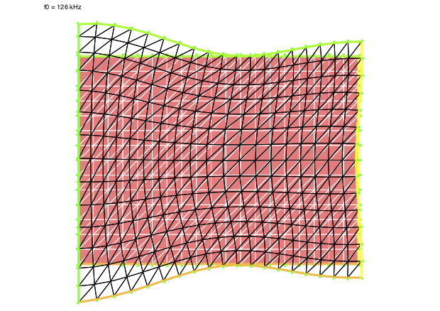

## mm-fem 

The minimalistic FEM code in html+wasm, python+numpy and freefem for the calculation of piezoelectric circular disk vabrations in the air (free vibrations). It implements variational equations in axisymetric mode. As material coefficients it uses PIC255 piezoelectric data. The default frequency is defined to be close to the thickness resonanse mode for circular disk with radius of R=1.9cm and thickness of T=1.41cm. 

Fig.1. Html screendump.

Fig.2. Python matplotlib generated vibrations

Fig.3. Freefem generated vibrations.

